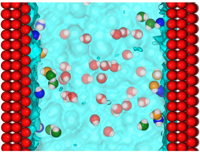

# The role of surface chemistry in the orientational behaviour of water at an interface 

This repository provides example input files to perform molecular dynamics (MD) simulation based calculations of the interfacial potential using surface models representing various chemistries as well as different solvents. Jupyter notebooks are also provided in each subdirectory for the visualisation and analysis

## Dependencies
`conda create -n my_env -c conda-forge mdanalysis=1.1 pytim openmm nglview notebook dask`

