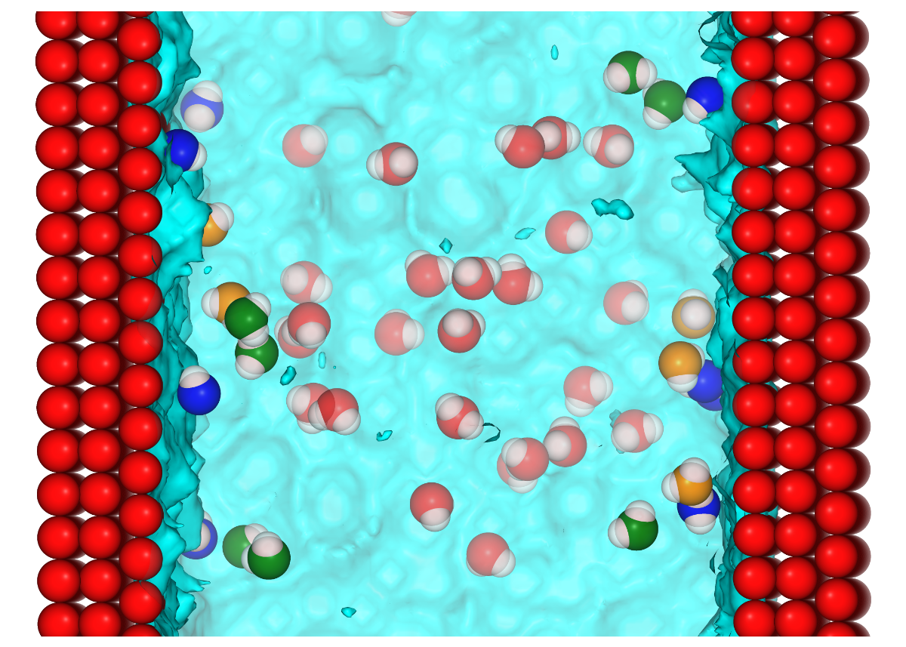

# The role of surface chemistry in the orientational behaviour of water at an interface 

This repository provides example input files to perform molecular dynamics (MD) simulation based calculations of the interfacial potential using surface models representing various chemistries as well as different solvents. An example jupyter notebook is provided for the visualisation and analysis of trajectory data.

## Dependencies
The dependencies needed to run the code contained in the Jupyter notebooks can most easily be installed with conda:  
`conda create -n my_env -c conda-forge mdanalysis=1.1 pytim openmm nglview notebook dask` 

The openmm package is only needed to analyse simulations involving water described by the AMOEBA14 water model. The dask package enables parallel analysis of simulation trajectories. Remove these packages from the conda environment installation if you do not wish to run the code contained in the amoeba14 folder.

## Troubleshooting
If nglview does not not display in the jupyter notebooks run these commands from a terminal: 

`jupyter-nbextension enable --py --sys-prefix widgetsnbextension`  
`jupyter-nbextension enable nglview --py --sys-prefix` 

